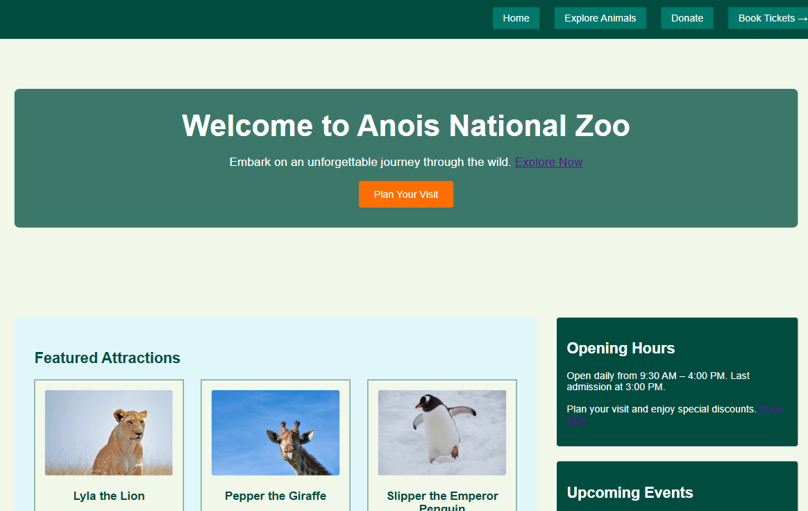
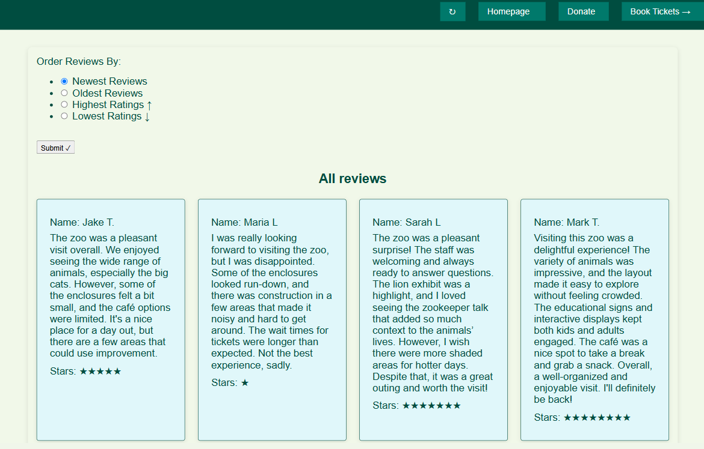
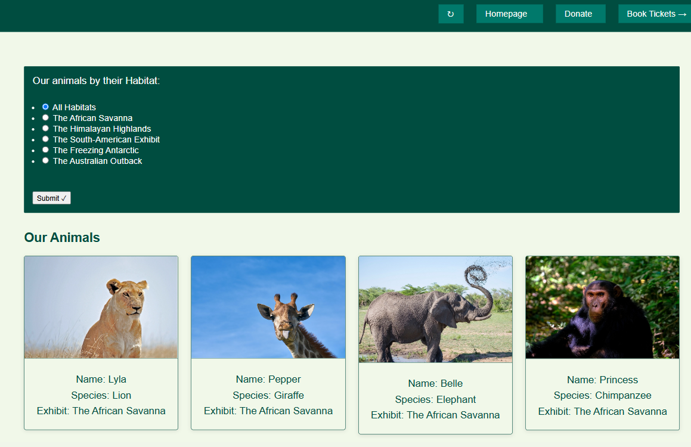
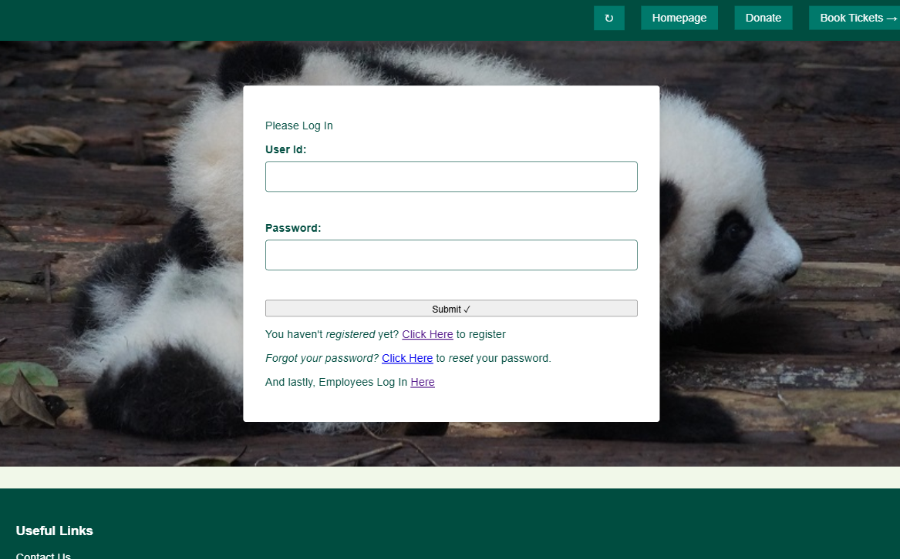

# Anois National Zoo Website

Welcome to the official repository for the **Anois National Zoo**! This is a dynamic web application built using Flask, enabling users to explore animal exhibits, leave reviews, make donations, book tickets, and much more.

## Features

- **User Authentication**:
  - Secure registration and login system.
  - Passwords are hashed for security.
  
- **Reviews**:
  - Users can leave reviews for the zoo with a rating and a date.
  - Recent reviews are dynamically displayed.

- **Animal Exhibit Exploration**:
  - Explore animals categorized by habitats.

- **Donations**:
  - Users can donate and see acknowledgment messages.

- **Ticket Bookings**:
  - Book tickets directly through the website.

- **Admin and Employee Management**:
  - Admins can manage animals, employees, and review content.

## 🛠️ Technology Stack

- **Frontend**:
  - HTML
  - CSS (with a responsive design)

- **Backend**:
  - Python (Flask Framework)
  - SQLite (Database)

- **Libraries**:
  - Flask-WTF (for forms)
  - Werkzeug (for password hashing)
 
## Screenshots

### Homepage

### Reviews Page

### Animal Info Page

### Login Page

